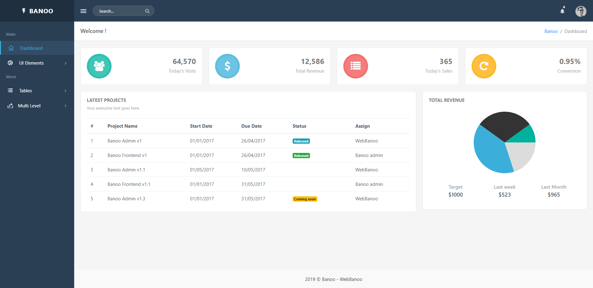

# Banoo - Admin Template !

Banoo Admin Template is build on Bootstrap 4, Sass, Javascript and JQuery.
This project is set on public github because I see helpful to others.
This project is still in development , and as soon as possible it will be an alpha version.

Here is a screenshot how it looks like until now:


### Features:
- [x] Full Responsive
- [x] Dashboard Page
- [x] Buttons
- [x] Basic Tables
- [x] DataTables
- [x] Responsive Tables
- [x] Multi Level Menu
- [ ] ~~Cards~~
- [ ] ~~Modals~~
- [ ] ~~Notifications~~
- [ ] ~~Progress Bar~~
- [ ] ~~Forms~~
- [ ] ~~Charts~~
- [ ] ~~Example Pages~~

### Demo Online:

```html
[Click here !](https://webbanoo.github.io/banoo/admin-primary/)
```


Banoo Admin Template will be implemented also in different enviroments like Laravel, Angular, VueJS, React as soon as possible.

I hope you will like it :D.


Feel free to make any contribution in BTC:

